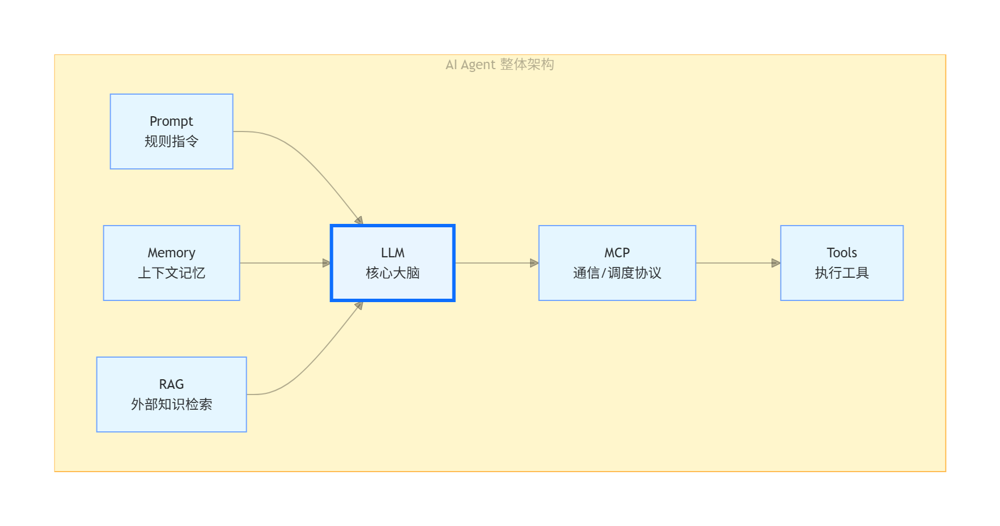

# AI Agent

## LLM 基础介绍

在讲解agent之前，先从LM说起，像DeepSeek、GPT这类产品，本质上都是基于大语言模型（LLM）的聊天机器人。可以简单把它理解成一本百科全书。

基于LM的聊天机器人，工作流程十分简单：**输入 → 模型处理 → 输出**。
举例：输入“给我一份会议纪要模板”，模型处理后就会直接输出对应模板，和日常对话使用DeepSeek的体验一致。

但这类基础模型存在局限：如果追问“我上一次会议是什么时候”，模型无法作答，因为它没有个人相关信息。

为了解决这个问题，可以给模型对接工具，比如日历工具。当询问会议时间时，模型会先调用日历查询，再给出答案。

## LLM Workflow 工作流讲解

提出需求：帮我把上一次会议纪要总结一下，并发到我的邮箱。
单一工具调用已经无法满足，完整流程变为多步骤串联：

1. 获取过往会议记录
2. 调用LLM完成内容摘要
3. 对接邮箱工具
4. 发送整理后的纪要邮件

这种**由多个固定步骤串联而成的流程，就叫做Workflow（工作流）**。
核心特点：哪怕流程节点再多、逻辑再复杂，也不属于agent。因为**所有执行步骤都是人为提前设计好的，AI仅按照既定路线机械执行**。

## Agent 与 Workflow 的核心区别

Agent 的运行模式可理解为：输入内容 → 内部自主处理 → 输出结果。
和Workflow最大的差异：**内部执行逻辑不由人预先设定，而是由Agent自主决策**。

沿用“总结会议纪要并发送邮箱”的需求，Agent的执行过程：

1. 自主思考：要完成任务需先获取会议时间与记录，尝试调用日历工具；
2. 发现日历无相关记录，主动切换工具，尝试连接腾讯会议查找会议记录；
3. 获取记录后，自主调用大模型完成内容总结；
4. 发现用户未提供邮箱地址，主动思考并判断需要先向用户询问，再继续执行。

整个过程中，Agent持续思考、自主判断下一步动作。

**一句话总结**：

- Workflow：执行人预先规定好的固定步骤；
- Agent：自主判断并决定执行步骤。

## Agent 的整体构成（类比数字员工/实习生）

可以把Agent看作**数字员工**来理解，它可7×24小时待命，使用成本远低于真人，如今也成为企业重点关注的数字劳动力，搭建Agent也成为一项重要技能。

一个完整的Agent主要由**五大核心部分**组成：

1. **LLM（大脑）**
   如同人的大脑，负责理解指令、分析任务、制定执行计划，是整个Agent的核心。
2. **Prompt（提示词）**
   类比岗位说明书，用来定义Agent的岗位职责、行为限制、回复风格等规则。
3. **Memory（记忆）**
   负责留存对话上下文、持续跟进任务、积累使用经验，避免“短时失忆”。
4. **External Knowledge（外部知识库）**
   补充LLM通用知识以外的专属内容，例如企业内部资料、产品文档、公司规章制度等。
5. **Tools（工具）**
   并非实体工具，而是电脑、手机中的各类应用与操作能力（发邮件、制作Excel/PPT、下单等）。赋予Agent软件操作权限，让AI从单纯“聊天”转变为实际“干活”。

### 补充：并非拥有五组件就是Agent

配齐以上五个组件，不代表就是真正的Agent。**判断核心是是否具备自主工作能力**，核心依托：**Agent Loop（智能体循环）**。

行业经典框架 **ReAct**，是 **Reasoning（推理）+ Acting（行动）** 的缩写（区别于前端框架React）。

举例：下达“做竞品分析”指令

1. 普通LLM：仅输出一段文字内容；
2. 具备Agent Loop的Agent：
   - 自主推理并行动：打开网页、搜索竞品信息、整理数据、制作可视化图表；
   - 自我校验：检查输出内容、图表是否符合要求；
   - 循环迭代：合格则输出结果，不合格则重新修改，重复上述流程。

**Agent Loop 本质**：思考方案 → 执行行动 → 自检结果，循环往复直至完成目标。核心特征是**自主自检、自主迭代**。

## 总结

1. 形象类比：LLM是大脑、Tools是手脚、Memory是记忆、Knowledge是资料库、Prompt是岗位说明书；
2. 核心判定：组件只是基础，**自主围绕目标推理、行动、自检、循环迭代**，才是Agent的本质；
3. 行业现状：目前Agent处于高速发展阶段，行业暂无统一官方定义，不同人群（学术界、工程团队、企业、普通用户）视角不同，解读版本也会存在差异，并无绝对对错之分。
