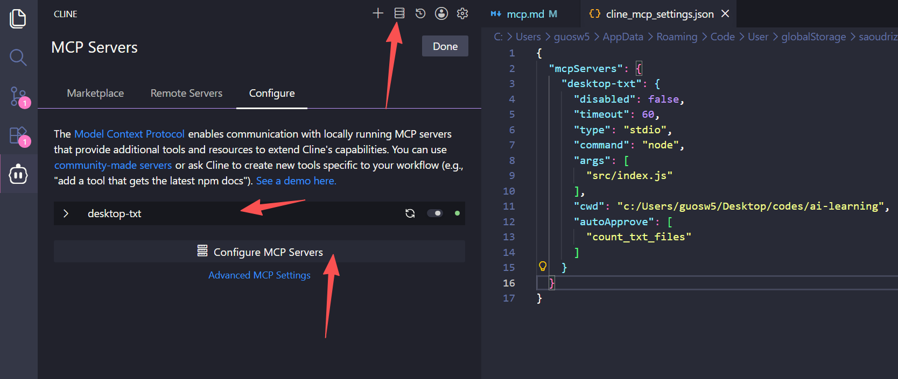
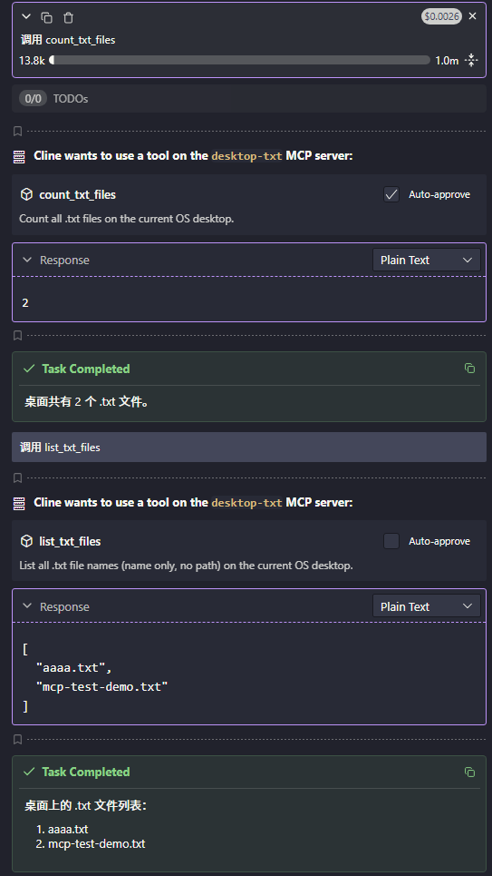

# MCP

> 让 LLM 调用外部工具的通信协议


## MCP Server 开发实践

[MCP Server 开发实践文档](https://modelcontextprotocol.io/docs/develop/clients/client-best-practices)

## 基于 AI 辅助编写 MCP Server

```text
请基于 node 实现一个标准的 MCP（Model Context Protocol）Server，严格遵循 MCP 协议规范。

功能需求：

- 自动获取当前操作系统的桌面路径
- 统计桌面上所有 .txt 后缀的文件数量
- 获取桌面上所有 .txt 文件的文件名列表（不含路径，仅文件名）
- 暴露两个 MCP 工具：count_txt_files、list_txt_files

实现要求：

- 兼容 Windows 平台
- 增加异常处理（文件权限、桌面路径不存在）
- 代码简洁、注释清晰、符合生产最佳实践
- 输出完整可运行代码 + 安装依赖命令 + 运行方法
```

## 使用 inspector 调试 MCP Server

```bash
npx @modelcontextprotocol/inspector node src/index.js
```

自动打开浏览器，点击 Connect -> List Tools -> 选择 count_txt_files 或 list_txt_files -> 点击 Run Tool。

即可看到运行结果。

## 在 Cline 中测试 MCP Server

配置 MCP Server



在 vscode 打开 Cline 插件，点击 mcp servers, Configure, Configure, 配置：

```json
{
  "mcpServers": {
    "desktop-txt": {
      "command": "node",
      "args": ["src/index.js"],
      "cwd": "c:/Users/guosw5/Desktop/codes/ai-learning"
    }
  }
}
```

## 验证写好的 mcp server


