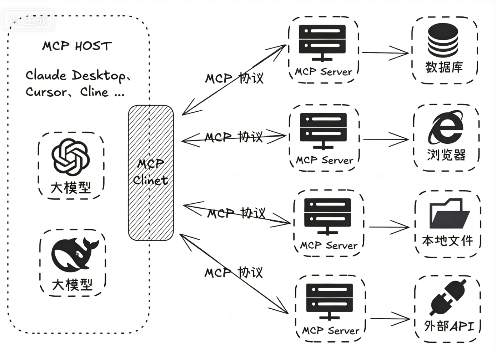

# MCP

## 什么是 MCP

MCP（Model Context Protocol）是 Anthropic 提出的 AI 工具通用接口标准。

可以把它理解为 AI 领域的「USB 接口」：统一大模型连接外部工具和数据源的方式。

它的基本结构如下：

- MCP 客户端
- MCP 服务端
- 外部资源（文件、数据库、API 等）

核心价值是：工具接入一次，就能被所有支持 MCP 的客户端复用，避免重复开发。

## MCP 的工作流程

1. 客户端向 MCP 服务端发起能力请求。
2. 服务端调用对应的外部资源或工具。
3. 服务端将结构化结果返回给客户端。
4. 模型基于返回结果继续生成回答或执行下一步操作。

## MCP 的优势

- 标准统一：降低工具接入成本。
- 生态复用：一个工具可服务多个 AI 应用。
- 扩展灵活：可按需接入本地或远程资源。
- 工程友好：便于权限控制、日志审计和能力治理。
