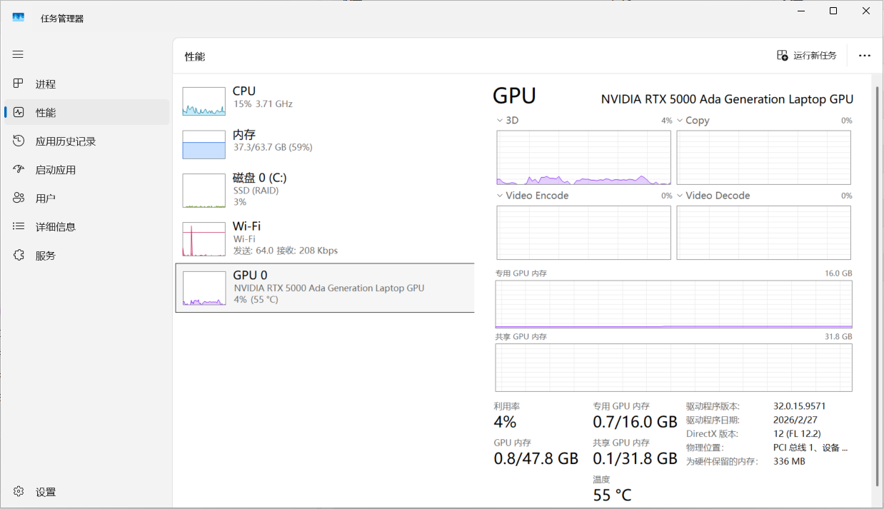

## 一、模型大小 / 场景 / 机器要求

| 参数大小     | 场景                      | 机器要求                        | 常见模型                                |
| ------------ | ------------------------- | ------------------------------- | --------------------------------------- |
| 0.5~3B       | 手机 / 边缘设备、简单问答 | 集显或任意显卡即可              | Phi-3-mini、Qwen2.5-0.5B、Gemma-2B      |
| 7~8B         | 个人本地聊天、代码辅助    | 8~12GB 显存（RTX 3060 / 4060）  | Llama 3.1 8B、Qwen2.5-7B、Mistral-7B    |
| 13~14B       | 企业任务、长文本分析      | 16GB 显存（RTX 4060 Ti）        | Qwen2.5-14B                             |
| 32~34B       | 高精度专业任务            | 24GB 显存（RTX 4090）           | DeepSeek-33B、Qwen2.5-32B               |
| 70B          | 科研、大型企业            | 32GB+ 或多卡（RTX 5090 / A100） | Llama 3.1 70B、Qwen2.5-72B              |
| 千亿级 / MoE | 前沿研究、逼近闭源        | 多卡集群 / 数据中心             | Llama 3 405B、DeepSeek-V3 671B、Kimi K3 |

::: tip 说明

- 以上机器要求按 **Q4 量化**估算（把参数压缩到 4 位，显存降到 1/4，质量接近原版）；用原版精度（FP16 不压缩）显存要 ×4
- MoE 模型总参大但每次只激活一部分，**显存仍需装下全部权重，速度按激活量算**
  :::

## 二、主流模型与命名分档

### 1. 各家旗舰 / 均衡 / 轻量命名区别

| 厂商             | 旗舰  | 均衡   | 轻量  | 命名由来             |
| ---------------- | ----- | ------ | ----- | -------------------- |
| OpenAI GPT-5.6   | Sol   | Terra  | Luna  | 天体（日 / 地 / 月） |
| Anthropic Claude | Opus  | Sonnet | Haiku | 音乐体裁             |
| Google Gemini    | Ultra | Pro    | Flash | 程度词               |
| 阿里 Qwen        | Max   | Plus   | Turbo | 程度词               |

::: tip 选型规律
编程三档差距小（日常用轻量 / 均衡即可），高难推理差距大（啃硬骨头上旗舰），长文档别用轻量档。组合策略：轻量初筛 → 均衡出方案 → 旗舰攻坚。
:::

### 2. GPT-5.6 三档对比

| 维度                     | Sol                | Terra          | Luna            |
| ------------------------ | ------------------ | -------------- | --------------- |
| 定位                     | 复杂推理、核心代码 | 智能与成本平衡 | 速度 / 成本优先 |
| 输出价（/1M）            | $20                | $12            | $1.2            |
| AA 智能指数              | ~59                | ~55            | ~51             |
| 高难数学 FrontierMath T4 | 83%                | 68.3%          | 58.5%           |
| 长文档 MRCR v2           | 91.5%              | 89.6%          | 41.3%           |

> 三档基础规格相同：105 万 token 上下文、12.8 万最大输出、文本+图像输入。

### 3. 主流模型简介

| 模型             | 厂商      | 类型 | 侧重点                         |
| ---------------- | --------- | ---- | ------------------------------ |
| GPT-5.6          | OpenAI    | 闭源 | 全能、多模态、超长上下文       |
| Claude           | Anthropic | 闭源 | 编码、Agent、长文本、安全合规  |
| Gemini           | Google    | 闭源 | 多模态（音视频原生）、性价比   |
| Grok             | xAI       | 闭源 | 实时信息、低成本               |
| Kimi K3          | 月之暗面  | 开源 | 前端编程、百万上下文、视觉编程 |
| Qwen3            | 阿里      | 开源 | 中文、生态、工具调用           |
| DeepSeek V4 / R2 | 深度求索  | 开源 | 性价比之王、推理、中文         |
| GLM-5            | 智谱      | 开源 | 编码、价格极低                 |
| Llama 3.1        | Meta      | 开源 | 英文生态最成熟、微调版本多     |
| Gemma 3          | Google    | 开源 | 多模态、轻量高效、边缘部署     |

## 三、快速判断本机能跑什么

### 1. Windows 查显存：任务管理器（最快）

1. 快捷键 `Ctrl + Shift + Esc` 打开任务管理器
2. 点 **性能** → 左侧选 GPU0 / GPU1（独显一般是 GPU0）
3. 右下角看 **专用 GPU 内存**，就是显卡自带显存（如 8.0GB）

::: warning
专用 GPU 内存 / 专用视频内存 = 真实物理显存；**共享内存是借用的系统内存，不算显卡自带显存**。
:::



### 2. 命令行查显存

```bash
# 查看显存总量 / 可用
nvidia-smi --query-gpu=memory.total,memory.free --format=csv,noheader
```

### 3. 其他方法

| 方法      | 操作                                              |
| --------- | ------------------------------------------------- |
| 公式估算  | 所需显存 ≈ 模型文件 × 1.2 + KV Cache + 1~3GB 开销 |
| LM Studio | 搜模型，标注能完全加载到 GPU 的会标绿             |
| Ollama    | `ollama run qwen2.5:7b`，自动选量化并提示是否卸载 |
