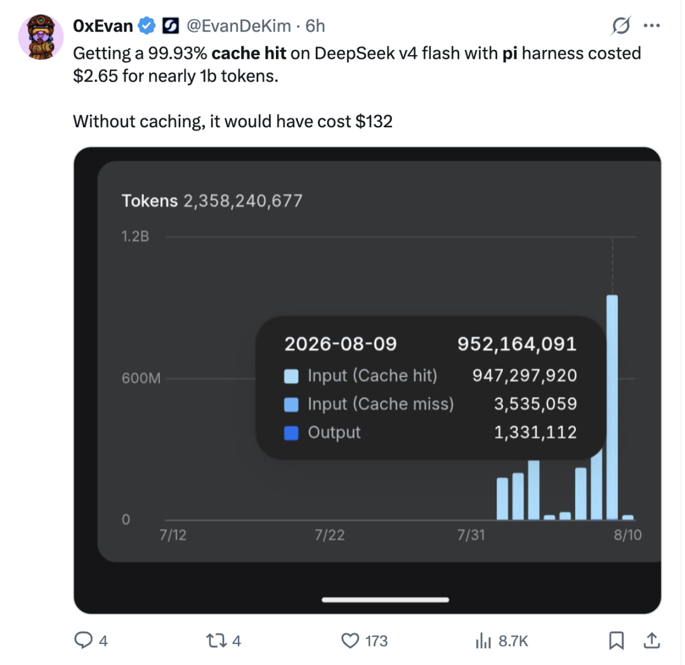
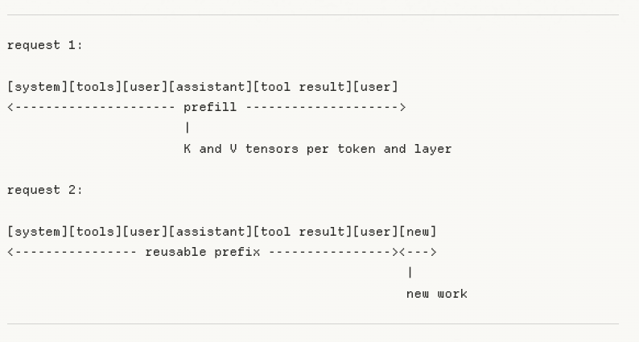
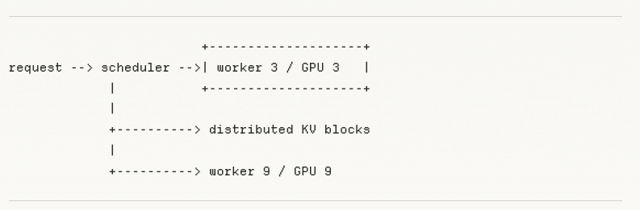
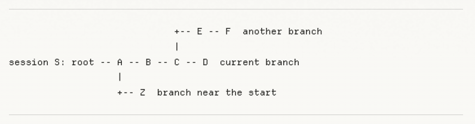
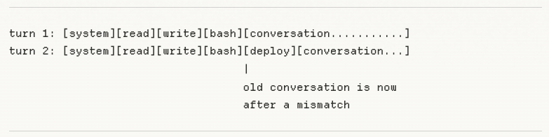
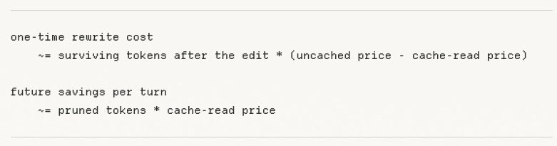

# 好的 Harness，先把缓存命中做好

## 核心命题：Agent = Model + Harness

在 AI Agent（尤其是复杂 Coding Agent）的工程演化中，业内逐渐形成了一个公认的共识：

> Agent = Model + Harness

- **Model（模型）**：决定了推理能力的上界，各大模型厂商（Claude、OpenAI、DeepSeek、Gemini）的能力正以每半年一个台阶的速度迭代并逐步拉平；
- **Harness（运行载体/马具）**：负责环境感知、会话管理、工具编排、上下文拼接与协议交互。

模型可以自由切换，Harness 也可以随需选择。当模型能力差距缩小时，**Harness 的工程质量就成为了决定 Agent 成败、稳定性与落地成本的关键分水岭**。

而成为优秀 Harness 的第一道生死线，就是：**Cache Hit（前缀缓存命中率）**。



根据开发者 Evan 披露的实测数据：他使用轻量 Harness（Pi Agent）运行 DeepSeek-V4-Flash，累计缓存命中率达到了 **99.93%**。

- **9.47 亿个命中缓存的输入 Token**：总账单仅花费 **$2.65**；
- **如果全部按未命中（冷启动）价格计算**：需要支付 **$132.62**；
- **两者成本直接相差 50 倍！**

::: tip 为什么要死磕缓存命中？
在大模型长会话交互中，**省钱 + 降低首字延迟（TTFT）** 是最直接的硬道理。通过优化 Harness 上下文结构让缓存命中率冲上 90%~99%，能为团队节省数倍甚至数十倍的 API 预算。
:::

---

## 一、回溯 Transformer：缓存命中到底是什么？

大模型处理一次请求，底层粗略分为两个物理阶段：

1. **Prefill（预填充阶段）**：模型必须先读完所有输入（系统提示词、工具定义、上下文历史、当前提问），计算每个 Token 之间的注意力权重矩阵，生成中间状态；
2. **Decode（逐字解码阶段）**：模型根据已计算的上下文，逐个 Token 自回归地生成后续回答。

在 Transformer 每一层注意力机制中，输入 Token 经过计算会生成对应的 Key（键）和 Value（值）张量，这些已经计算好的中间状态就是 **KV Cache**。



### 1. KV Cache 的本质：计算底稿，而非答案

- **KV Cache 不是答案文本**：它不是可以拿给用户阅读的文字，也不是搜索引擎里的文本缓存；
- **KV Cache 是模型算过的“思维笔记”**：代表了模型读过前序 Token 后的数学状态。

### 2. Prompt Cache vs Response Cache

很多初学者容易混淆两种完全不同的缓存类型：

| 缓存类别                                | 触发条件                                | 底层机制                                                         | 结果表现                                          | 适用场景                          |
| :-------------------------------------- | :-------------------------------------- | :--------------------------------------------------------------- | :------------------------------------------------ | :-------------------------------- |
| **Response Cache**<br>_(响应/语义缓存)_ | 用户提了完全相同或语义相似的问题        | 绕过大模型推理，直接从 Redis/向量库返回上次生成的回答            | 答案完全固定，无法体现随机性与新推理              | FAQ 客服、固定知识问答            |
| **Prompt Cache**<br>_(前缀/KV 缓存)_    | 输入请求包含了相同的**前缀 Token 序列** | 跳过重复的 Prefill 计算，直接复用已有的 KV 张量，继续进行 Decode | 答案仍然实时生成，保持多样性与温度（Temperature） | Coding Agent、长历史多轮对话、RAG |

### 3. 前缀（Prefix）的严格数学定义

Agent 发送给大模型的请求，通常按以下顺序拼接：

```
[系统提示词] [工具定义] [项目说明] [对话历史] [本轮新消息]
<-------------- 可复用的公共前缀 -------------> <-- 新增后缀 -->
```

所谓**前缀（Prefix）**，在推理引擎中指的是：**从第 1 个 Token 开始，连续且完全一致的序列**。

- 它认的是**字节级的精确匹配**，而不是“意思差不多”；
- 如果前 50,000 个 Token 完全一致，那这 50,000 个 Token 就是公共前缀，可以直接复用缓存；
- **中途一旦出现任何分叉（例如在第 10 个 Token 处插入了动态时间戳），从分叉点起往后的所有 50,000 个 Token 对应的 KV 状态全部失效，必须全量重算！**

```
正确复用：
上一轮：[A] -> [B] -> [C]        （计算 A, B, C）
下一轮：[A] -> [B] -> [C] -> [D] （复用 A, B, C，只计算增量 D）

前缀断裂：
上一轮：[A] -> [B] -> [C]
下一轮：[A] -> [B_新] -> [C] -> [D]
             ↑ 从这里断开！B_新、C、D 全部需要重新全量 Prefill！
```

::: warning Agent 的真实计费单位
一个 Coding 会话积累了 10 万 Token 的历史，你只给它发送了两个字：“继续”。

- **无缓存**：模型无法直接理解“继续”，必须先重新读完前面的 10 万 Token 完成全量 Prefill，才开始吐字；
- **有缓存**：10 万 Token 的前缀直接复用 KV Cache，立即开始解码。
- **Agent 的真实成本核心，往往不是本次回答写了多少字，而是为了回答这句话，模型被迫从头重读了多少万个历史 Token。**
  :::

---

## 二、模型供应商视角：底层缓存架构与计费

对提供推理 API 的供应商来说，缓存并不是慈善，而是提高集群吞吐、压榨 GPU 效率的核心技术手段。



### 1. 缓存的物理存储分层

推理服务商在机房内部署 vLLM、SGLang 等引擎时，KV Cache 的落脚点分为三层：

| 存储介质                |   访问速度   |                  成本与容量                  | 典型存活时间 (TTL)  | 定价与定位                                            |
| :---------------------- | :----------: | :------------------------------------------: | :-----------------: | :---------------------------------------------------- |
| **GPU HBM (显存)**      | 极快（TB/s） | 极度昂贵，容量极小（单卡仅能存十数个长会话） |   通常 5 分钟左右   | 最低费率（1 折），但高峰期极易被 LRU 驱逐             |
| **CPU DDR (主机内存)**  |     较快     |        容量适中，需经由 PCIe 拷回 GPU        | 约 30 分钟 ~ 1 小时 | 中间费率（Anthropic、Gemini 隐式缓存主要依托内存）    |
| **NVMe SSD / 本地硬盘** |     中等     |              容量巨大，成本极低              |    数小时至数天     | 超长持久化（**DeepSeek** 独创的“上下文硬盘缓存”架构） |

### 2. 缓存管理策略：隐式 vs 显式 vs TTL

- **自动隐式缓存（Implicit Cache）**：由 Provider 服务端自动识别多请求间的公共前缀，开发者无需在代码中做任何特殊标记（如 DeepSeek、OpenAI 自动隐式断点、Gemini 2.5+）；
- **显式缓存（Explicit Cache）**：由开发者主动在消息末尾标注缓存锚点（如 Anthropic 的 `cache_control: {"type": "ephemeral"}`）或建立专用的缓存容器对象；
- **TTL（生存时间）的真相**：TTL 只是厂商承诺的**存活上限，而非存活保证**。在实际生产集群中，若并发流量暴增导致 GPU 显存或节点内存满载，即使未到 5 分钟，旧缓存也会被提前逐出；若跨机路由缺乏**前缀亲和性（Prefix Affinity Routing）**，请求被随机打到另一台机器，同样会导致 Cache Miss。

### 3. 主流模型厂商前缀缓存策略横评

| 供应商                 | 缓存机制                                                  | 典型生命周期 (TTL)                                            | 计费折扣与特点                                                                                         |
| :--------------------- | :-------------------------------------------------------- | :------------------------------------------------------------ | :----------------------------------------------------------------------------------------------------- |
| **DeepSeek**           | 自动上下文硬盘缓存，按完整前缀单元匹配                    | 不设死板承诺，空闲后通常在**数小时到数天内**清理              | **极致性价比**：DeepSeek-V4-Flash 命中输入价格低至未命中的 **1/50（仅 2% 费用）**，V3 命中费率约为 1/4 |
| **Anthropic (Claude)** | 显式 `cache_control`，可在请求消息中指定断点              | 默认 5 分钟，可选 1 小时长寿命                                | 读取为基础输入价的 **0.1 倍（1 折）**；5 分钟写入为 1.25 倍，1 小时写入为 2 倍                         |
| **OpenAI**             | 自动隐式断点；GPT-5.6+ 起支持显式断点配置                 | GPT-5.6+ 基础存活 30 分钟起；老模型 5~10 分钟                 | 写入按未缓存输入价的 1.25 倍计费，读取享受 50%~80% 专属折扣                                            |
| **Google (Gemini)**    | Gemini 2.5+ 默认隐式缓存；老 API 需显式创建 Context Cache | 隐式缓存驻留 RAM，最长 24 小时（Best Effort）；显式对象可自定 | 命中按模型折扣计费；显式创建的缓存对象需按小时按容量收取存储租金                                       |

---

## 三、Harness 构建者视角：怎样保护缓存前缀？

对于 Coding Agent 而言，每轮交互发送的信息量极为庞大：系统设定、项目规则、环境拓扑、几十个工具的 Schema、多轮对话流转、工具调用参数与命令执行输出。

优秀的 Harness 设计必须遵守以下五大前缀保护工程法则：

### 法则 1：保持系统前缀“字节冻结”（Prefix-Stable）

系统提示词（System Prompt）位于全部请求的最开端。**如果它发生改变，后面数万个 Token 的缓存将瞬间全军覆没**。

- ❌ **严重反模式**：在 System Prompt 里动态拼接 `当前时间: 2026-09-04 15:30:00`、动态拼接当前操作系统路径、把当前模式切换指令塞进系统词；
- ✅ **正确做法**：System Prompt 在 Session 初始化后**绝对字节冻结**。动态时间、环境变化或模式指令，统一作为 `user` 角色的通知消息追加在对话流尾部（Append-only）。

### 法则 2：适应 Session 树形分支路由（Tree Navigation）

在现代 Agent 交互中，用户的操作不是线性的，往往涉及“回退修改代码”、“撤销重试”或“开辟子任务”。



- 会话不是一条死板的流水线，而是一棵**分支树**；
- **缓存认的是当前分支的 Token 路径，而不是 Session ID**：从某个旧节点分叉出去的新对话，只能复用分叉点之前的历史缓存；
- Harness 在调度请求时，必须保证同一分支连续请求命中相同的节点路由，避免跨机器漂移。

### 法则 3：工具集（Tools Schema）恒定克制



工具定义位于提示词的前部。许多初学者试图在不同轮次动态增删工具：

- 比如为了某个任务临时塞入 `read_pdf`、`query_db` 工具；
- 或者由于 Python/JSON 库序列化时 Key 顺序随机抖动，导致序列化出的字符串发生微调。

这种做法为了省下几百个 Token 的工具定义，却让后面数万个 Token 的上下文缓存全部失效，**“相当于为了省停车费把整辆车换了”**。

::: tip 优秀实践

- **固定核心工具集**：保持 10~16 个基础高频工具常驻，Schema 与参数结构保持恒定；
- **增量能力子 Agent 化**：复杂专项能力通过 `invoke_skill` 派发子 Agent 在独立空间执行，中间过程不污染主历史，主历史只记录输入和最终摘要；
- **序列化保证**：确保 JSON Schema 序列化时按固定 Key 排序，避免字符级抖动。
  :::

### 法则 4：谨慎 Prune，将压缩视为“有计划的缓存重置”

许多 Harness 开发者有一个执念：认为“消息历史越短，费用越低”，因此会激进地 Prune（剔除/裁剪）中间的工具执行日志或早期对话。



- **中间挖洞的代价**：如果被剪裁的内容已经在命中费率为 0.1x 的廉价缓存前缀中，从中间删去几百字，会导致删除点之后的数万 Token 全部变成 1.0x 全价 Prefill！
- **正确理解 Compaction（上下文压缩）**：
  - 压缩不是随时随地零碎进行的；
  - 必须把压缩视作一次**“有计划、有成本的缓存重置”**；
  - 只有当历史接近窗口临界值，且预估**“后续 N 轮由于上下文缩短而节省的开销，显著大于本次打破缓存重算的代价”**时，才执行一次性彻底压缩。

### 法则 5：可观测性与精准测量

没有测量就没有优化。千万不要等到月底收到信用卡账单才发现缓存一直在裸奔。

#### 1. 缓存命中率的准确计算公式

以 DeepSeek 为例，官方返回的指标包括 `prompt_cache_hit_tokens`（命中量）与 `prompt_cache_miss_tokens`（未命中量）。

$$\text{Cache Hit Rate} = \frac{\text{Cache Read Tokens}}{\text{Uncached Input Tokens} + \text{Cache Read Tokens} + \text{Cache Write Tokens}}$$

::: warning 注意
计算分母中**绝对不能混入 Output Tokens（解码输出）**，因为输出是模型生成的增量内容，不属于提示词前缀范畴。
:::

#### 2. Harness 必须提供的观测视图

- **单轮度量**：实时打印本轮 Cache Read、Cache Write、Cache Miss 详情与实际成本；
- **累计度量**：记录全会话累计命中率，对低于 85% 的异常轮次自动告警；
- **失效根因捕获**：当某轮缓存命中率暴跌为 0 时，自动 Diff 上下文前缀，标出破坏断点的具体字符。

---

## 四、商业落地实战：缓存省下的钱归谁？

在长会话 Agent 应用中，缓存命中率直接决定了各参与方的经济收益：

```
                    ┌────────────────────────────┐
                    │      模型供应商 (Provider)   │
                    │   (显存释放、吞吐提升、省电)   │
                    └──────────────┬─────────────┘
                                   │
              ┌────────────────────┴────────────────────┐
              ▼                                         ▼
   【直连调用 / 透传计费】                    【统一单价 / 固定包月中转】
   Provider 账单直接打折                      中转商按普通全价收费
              │                                         │
              ▼                                         ▼
   ★ 用户钱包直接省下 50~90% 费用           ★ 价差转化为中转商的高额毛利
```

- **直接调用官方 API 或使用透传计费的网关**：前缀缓存优化省下来的每一分钱，都会实打实地减免在你的云账单上；
- **固定单价的中转平台**：如果不透传底层缓存折扣，你在 Harness 上辛辛苦苦做的高命中优化，最终只是为中间商贡献了丰厚的利润。因此在企业架构选型时，务必考察服务商是否支持透明传递 Cache Usage。

---

## 五、缓存命中率暴跌的排查清单（Checklist）

如果发现会话的缓存命中率突然跌入谷底，请对照以下 8 点逐一排查：

1. [ ] **空闲时间是否超过了 TTL**：用户是否中途暂停思考、吃饭超过了 5~30 分钟，导致服务端 GPU 显存被 LRU 逐出？
2. [ ] **提示词前部是否渗入了动态内容**：System Prompt 中是否误写了动态时间戳、随机数、环境变量或动态用户名？
3. [ ] **是否切换了会话分支（Branch Fork）**：用户是否执行了回退（Rewind）或从旧树枝上长出新分支，导致脱离了原有长路径？
4. [ ] **工具 Schema 是否发生微调**：工具定义顺序是否变动？JSON 键值对是否由于未排序而字符随机漂移？
5. [ ] **是否进行了不合理的局部 Prune**：是否在历史中间删减了某条工具调用日志，导致后方前缀整体断裂？
6. [ ] **是否切换了模型或 Provider**：即使模型同名，跨不同服务节点或跨微版本更新，KV Cache 也无法共享；
7. [ ] **本地客户端中间件是否悄悄改写历史**：是否有拦截器或插件在历史请求上动态追加了未持久化的标记？
8. [ ] **服务端节点调度与跨机漂移**：集群在并发高峰期是否因负载均衡策略未配置前缀亲和性而把请求分流到了冷机器？

---

## 六、极简核心口诀

- **稳定输入保持稳定**：开头部分字节冻结，打死不改；
- **动态变更新增追加**：时间环境放最后，只做追加；
- **工具定义固化克制**：十六工具守初心，进阶派发；
- **缓存监控透明可见**：算清读写与命中，降本增效。

---

## 参考资料与延伸阅读

1. [DeepSeek 官方上下文硬盘缓存技术文档](https://api-docs.deepseek.com/zh-cn/guides/kv_cache/)
2. [Anthropic Claude Prompt Caching 官方指南](https://platform.claude.com/docs/en/build-with-claude/prompt-caching)
3. [OpenAI API Prompt Caching 技术文档](https://developers.openai.com/api/docs/guides/prompt-caching)
4. [Google Gemini Context Caching 文档](https://ai.google.dev/gemini-api/docs/caching)
5. [Earendil Engineering: Prompt Caching in Agents 原文](https://earendil.com/posts/prompt-caching/)
6. [51CTO：好的 Harness，先把缓存命中做好](https://www.51cto.com/article/852619.html)
