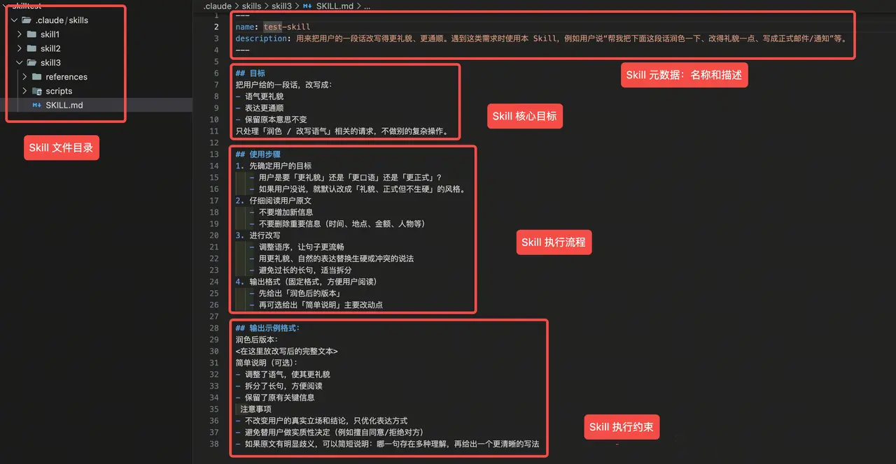

## Skills 到底是什么？

在传统的 AI 聊天模式中，AI 的能力取决于：

- 它原本学过什么（训练数据）
- 你临时在对话框里告诉它什么（提示词、工具、记忆）

这就像你招了个什么都懂一点的实习生，每次干活你都得重新教一遍。
而 Agent Skills 带来了一种全新的玩法：模块化能力插件。
你可以把 Claude（支持 Skills 的客户端）想象成一个超级大脑，而 Agent Skills 就是给这个大脑安装的外接工具箱。

这个工具箱里不仅有工具本身，还包含了详细的 “官方使用说明书”，大脑不需要理解具体有哪些工具以及工具的用法是什么，只需要在需要使用某个工具时查看工具说明书，再把工具拿出来用。

## Skills 长什么样？

每个 Skill 都是一个实实在在存在的文件夹，它存放在一个固定的位置（如 .claude/skills）这个文件夹里装着下面几样东西：

- 指令（SKILL.md）：告诉 AI 怎么干活的 SOP。
- 参考（reference）：更详细的参考文档（可选）。
- 脚本（scripts）：比如 Python 代码，让 Skill 也能调用外部能力（可选）。
- 资源（assets）：图片、模版等可能使用到的资源（可选）。

如果你在你的 Agent（如 Claude Code）执行目录（如你的项目代码目录）下放了这个文件夹，
那下次和 Agent 对话的时候就能自动根据你的需求匹配到这个 Skill，不需要再进行任何额外的配置。
比如，你希望 Agent 帮你润色文章，就可以编写一个下面这样的 Skill：

上面的三根短横线部分相当于 Skill 的「身份证」：

- name 是它的唯一标识，起个简单好记的英文名字就行。
- description 则决定什么时候会触发这个 Skill。这里要描述清楚这个 Skills 是做什么的、遇到什么样的用户请求应该用它。描述越具体，越容易在正确场景被调用。

下面就是 Skill 的正文部分：

- 目标：简单描述清楚这个 Skill 要做的事情。
- 使用步骤：列出 Skill 的操作流程，比如先搞清楚想要什么风格、再读原文、再改写、最后规定输出格式。
- 注意事项：告诉模型「什么不要做」，比如不要乱加内容、不要替用户做决定、有歧义要提醒。

看起来挺普通的？似乎很多能力都可以做这件事？

- 可以把这段文字和要润色的文章直接发给大模型？
- 可以把这段文字放到系统提示词？
- 可以把这段固定的流程封装为一个 Workflow？
- 可以把这段文字编写为一个 Agent.md 或者项目级的 Rules？

这些方式看似不同，但本质上只是把提示词放在了不同的位置，你给 AI 的每次对话都会带上这些提示词。

在真实的业务场景中，一个 Agent 不可能只干一件这么简单的事。大家试想一下，如果你要给 AI 装 50 个技能，每个技能都有几千字的说明书，要是系统一启动就把这些全塞进 AI 的脑子（Context Window）里，那么就会：

- 成本爆炸，每次对话可能都会消耗几万 Token。
- AI 的注意力也会被分散，变得“这也想干，那也想干”。

Skill 的出现就是为了解决这种问题，它有一个非常核心的机制，叫渐进式披露（Progressive Disclosure）。说人话就是：按需加载，用多少拿多少。

## Skills 的核心机制

这是我觉得 Agent Skills 设计得最聪明的地方。你可以把它想象成我们在图书馆查资料的三个步骤，非常直观：

### 第一层：先看目录（元数据 Metadata）

- 什么时候加载？系统刚启动的时候。
- 加载什么？只加载每个技能的名字和一段简短的描述。
- 有什么用？这一层占用的资源极少，可能就几百个 Token。它的作用就是告诉 Claude：“嘿，你的工具箱里有‘查周报’、‘处理 Excel’这几个工具哦。”
- 结果：Claude 知道自己“会什么”，但还不知道“具体怎么做”。

### 第二层：翻开手册（指令 Instructions）

- 什么时候加载？当你说“帮我把这个 Excel 处理一下”的时候。
- 加载什么？Claude 发现这事儿归“Excel 处理”这个技能管，于是它才会通过后台命令，去读取那个文件夹里的 SKILL.md 文件。
- 有什么用？只有在这个时候，那些详细的操作步骤、注意事项才会进入 AI 的脑子。

### 第三层：动手干活（运行时资源 Runtime Resources）

- 什么时候加载？当 SKILL.md 里的步骤明确要求读取额外文档、执行脚本或访问资源的时候。
- 加载什么？比如 reference 里的补充文档、scripts 里的脚本、assets 里的图片或模版。
- 有什么用？让 Skill 不只是“会说怎么做”，而是真的能在需要时调用外部资源完成任务。举例来说，用户下达的任务可能是分析 Excel，也可能是创建 Excel，这两个操作的处理步骤可能完全不同，因此可以把更细的操作说明拆到不同的 reference 中。Claude 识别到具体任务后，再按需读取对应文档。
- 结果：Claude 不需要一开始就把所有细节都装进上下文里，而是在执行过程中按需取用，既节省成本，又提高准确性。

其中还有一个很重要的点：如果 Skill 内置了可执行脚本，SKILL.md 或 reference 只需要告诉 Claude 何时调用、如何调用这些脚本即可。脚本本身的代码不需要整体塞进上下文，因此即使脚本文件很大，也不会直接带来额外的 Token 消耗。

这就是 Skill 最关键的价值：把能力拆成可发现、可加载、可执行的模块。系统平时只保留一个轻量目录，真正需要时再逐层展开，从而在能力规模和上下文成本之间取得平衡。

> 这意味着：一个 Skill 可以打包整套说明文档、大量的执行脚本，但只要任务不需要，这些内容就永远不会占用上下文。
